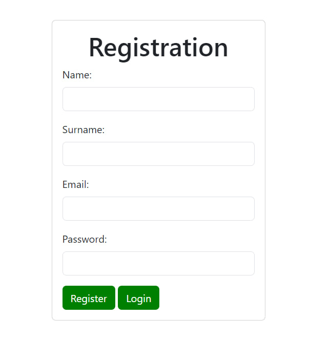
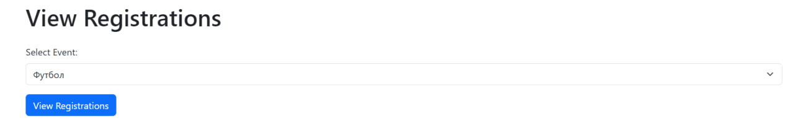

# Лабораторная работа №10
## Тема: Взаимодействие с базой данных

### Задание:

Разработайте веб-приложение для платформы проведения городских мероприятий. Платформа будет позволять гражданам узнавать и записываться на мероприятия.

### Задание 1. Создайте базу данных "event_platform".


### Задание 2. Создайте следующие таблицы в базе данных и корректно установите между ними отношения.

2.1. `users`: пользователи (используется таблица с лабораторной работы №9).

```sql
CREATE TABLE `users` (
  `id` int NOT NULL,
  `name` varchar(255) NOT NULL,
  `surname` varchar(255) NOT NULL,
  `email` varchar(255) NOT NULL,
  `role_id` int NOT NULL
) ENGINE=InnoDB DEFAULT CHARSET=utf8mb4 COLLATE=utf8mb4_0900_ai_ci;
```

2.2. `events`: мероприятия  
`id`  
`name`: название мероприятия  
`price`: цена мероприятия   
`number_seats`: количество мест   
`date`: дата и время

```sql
CREATE TABLE `events` (
  `id` int NOT NULL,
  `name` varchar(255) NOT NULL,
  `price` int NOT NULL,
  `number_seats` int NOT NULL,
  `date` datetime NOT NULL
) ENGINE=InnoDB DEFAULT CHARSET=utf8mb4 COLLATE=utf8mb4_0900_ai_ci;
```

2.3. `event_records`: записи на мероприятие   
`id`   
`user_id`: id пользователя   
`event_id`: id мероприятия

```sql
CREATE TABLE `event_records` (
  `id` int NOT NULL,
  `user_id` int NOT NULL,
  `event_id` int NOT NULL
) ENGINE=InnoDB DEFAULT CHARSET=utf8mb4 COLLATE=utf8mb4_0900_ai_ci;
```

2.4. `roles`: роли (user / manager)   
`id`   
`name`: название роли

```sql
CREATE TABLE `roles` (
  `id` int NOT NULL,
  `name` varchar(255) NOT NULL
) ENGINE=InnoDB DEFAULT CHARSET=utf8mb4 COLLATE=utf8mb4_0900_ai_ci;
```

### Задание 3. Внесите изменения в таблицу пользователей, добавив поле role_id, содержащее идентификатор определенной роли.

```sql
ALTER TABLE users
ADD COLUMN role_id INT NOT NULL;
```
### Задание 4. Создайте четыре страницы:

__Страница с текущими мероприятиями__   


__Страница для записи на определенное мероприятие__


__Регистрация__



__Авторизация__


### Задание 5. Разработайте административную панель (доступную только пользователю с ID 'manager'), обладающую следующим функционалом: 

__Панель администратора__


__Добавление мероприятия__


__Изменение мероприятия__


__Просмотр зарегистрированных на мероприятие.__




### Задание 6. Сохраняйте все необходимые данные в базе данных.

`event_platform.sql`

### Выводы:

В данной лабораторной работе было разработано веб-приложение для платформы проведения мероприятий. 

Все необходимые данные сохраняются в базе данных, обеспечивая надежное хранение информации о мероприятиях и пользователях.

Такого рода задание было выполнено мной первый раз и , определённо ,стало новым опытом в изучении WEB программирования. 